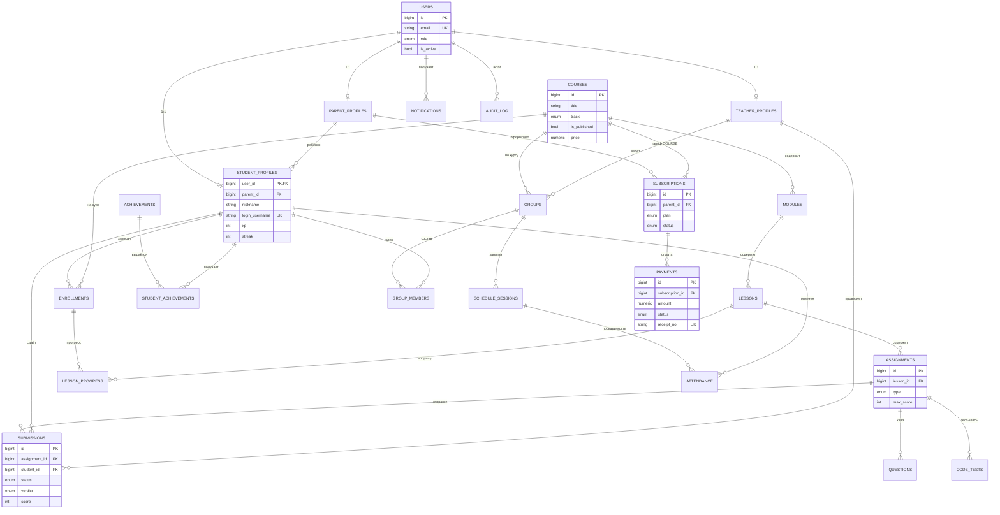
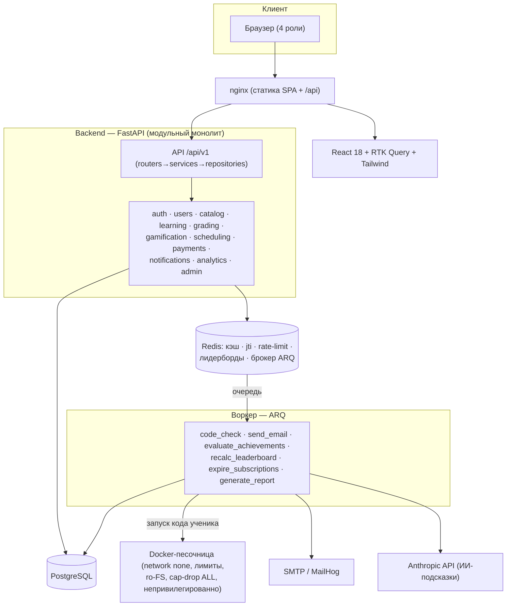
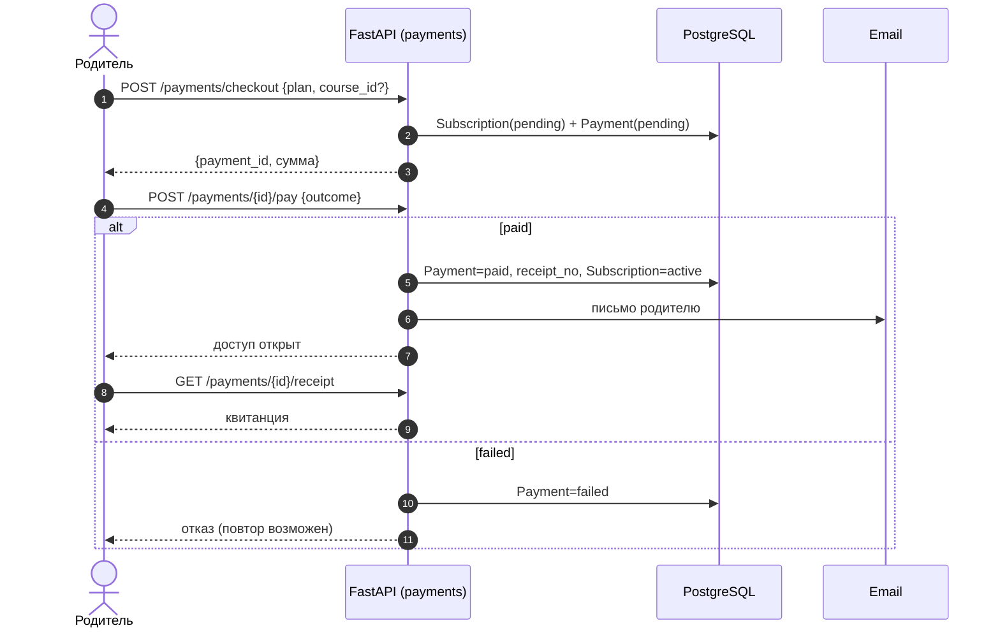
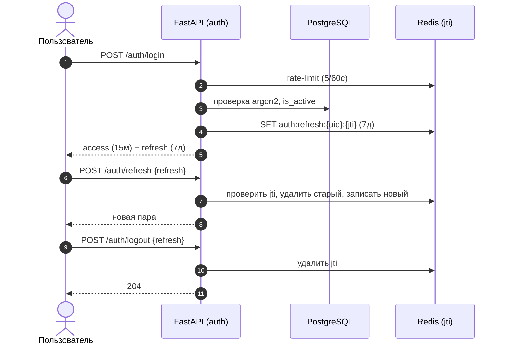
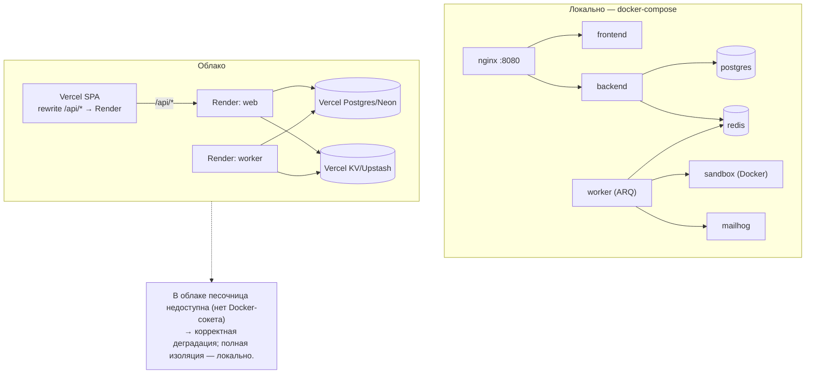

# Диаграммы CodeKids

Диаграммы в нотации **Mermaid**. Они рендерятся прямо на GitHub (в этом файле) и
дублируются отдельными файлами в [`docs/diagrams/`](diagrams/) для экспорта.

**Как получить картинку для ВКР (PNG/SVG):**
1. Открыть <https://mermaid.live>, вставить содержимое нужного `.mmd` → «Download PNG/SVG»; или
2. VS Code + расширение *Markdown Preview Mermaid Support* → превью этого файла → скриншот; или
3. CLI: `npx @mermaid-js/mermaid-cli -i docs/diagrams/er.mmd -o er.png`.

| Диаграмма | Файл | Артефакт ВКР |
|---|---|---|
| ER базы данных | [er.mmd](diagrams/er.mmd) | Рис. 4–5 |
| Архитектура (компоненты) | [components.mmd](diagrams/components.mmd) | Рис. 14–15 |
| Sequence: песочница | [seq_sandbox.mmd](diagrams/seq_sandbox.mmd) | Рис. 18 |
| Sequence: оплата | [seq_payment.mmd](diagrams/seq_payment.mmd) | схема оплаты |
| Sequence: JWT | [seq_jwt.mmd](diagrams/seq_jwt.mmd) | Рис. 17 |
| Развёртывание | [deployment.mmd](diagrams/deployment.mmd) | Рис. 16 |

---

## 1. ER-диаграмма базы данных



> Полная версия со всеми атрибутами — в [er.mmd](diagrams/er.mmd).

---

## 2. Архитектура (компоненты)



---

## 3. Sequence: автопроверка кода в песочнице (защищаемое ядро)

```mermaid
sequenceDiagram
    autonumber
    actor S as Ученик
    participant API as FastAPI (grading)
    participant DB as PostgreSQL
    participant R as Redis (очередь)
    participant W as Воркер ARQ
    participant Box as Docker-песочница
    participant AI as Anthropic API

    S->>API: POST /assignments/{id}/submit/code {code}
    API->>DB: Submission(status=queued)
    API->>R: enqueue code_check
    API-->>S: 202 {submission_id}
    R->>W: code_check(submission_id)
    loop по тест-кейсам
        W->>Box: контейнер (network none, лимиты, timeout)
        Box-->>W: {stdout, stderr, exit_code, timed_out}
    end
    W->>DB: status=checked, verdict, score, result_json
    opt passed
        W->>DB: mark_lesson_completed → XP/достижения
    end
    loop опрос ~1.2с
        S->>API: GET /submissions/{id}
        API-->>S: статус / вердикт / тесты
    end
    opt не passed
        S->>API: GET /submissions/{id}/hint
        API->>AI: код + stderr (без эталонов)
        AI-->>API: подсказка
        API-->>S: {hint, source}
    end
```

---

## 4. Sequence: оплата (имитация шлюза)



---

## 5. Sequence: JWT-аутентификация



---

## 6. Схема развёртывания


